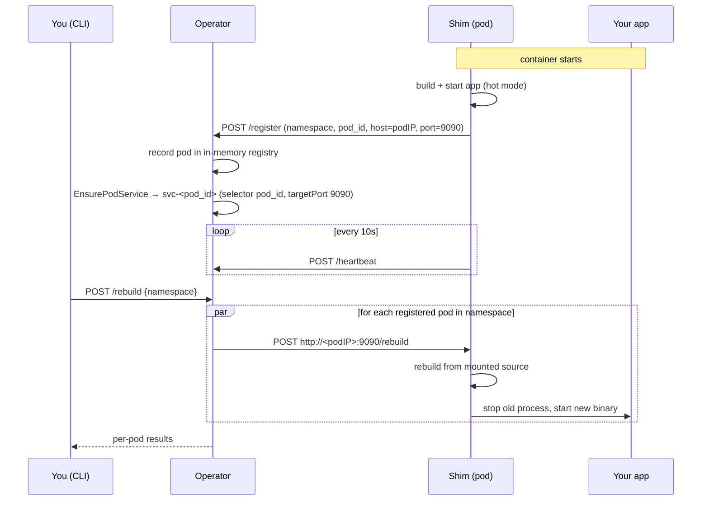

# shimshimney

If you have 10 or so microservices in a compiled language like Golang, the main time sink on a full rebuild is the copying of the entire build context into the docker daemon. The computation of the cache keys is a big part of this as docker has to cache all the files to compute this key, it can't use last update time etc otherwise the key wouldn't match on remote servers.

I've seen reductions of 3-5 minutes down to 10-15 seconds using shimshimney as the vendor folder persists and you can just reload the `go run`, in a similar way to `npm run dev` except it's manual for compiled languages.

shimshimney rebuilds the code running inside a Kubernetes pod **without
rebuilding its container image**. A small **shim** is the container entrypoint:
it builds and runs your application, registers with an **operator**, and exposes
a `/rebuild` endpoint. When you trigger a rebuild, the operator fans the request
out to every registered pod, which recompiles from a mounted source directory
and restarts the app in place. A **CLI** (`shimshimney`) drives the operator API.

## How it works

The source code is mounted into each pod from a volume (a `hostPath` from the
k3d node in the example), so the compiler inside the pod always sees the latest
code. A rebuild is therefore just "recompile and restart the process" — no image
build, no push, no pull.



### Registration and Service creation

When the shim starts in `hot` mode it registers itself with the operator,
sending its namespace, pod ID, host, and the port its `/rebuild` endpoint
listens on (`9090`). The host is the pod IP, injected via the downward API
(`status.podIP`) in [example/k8s/backend-template.yaml](example/k8s/backend-template.yaml).

On each `/register`, the operator:

1. Upserts the pod into an in-memory registry keyed by `namespace/pod_id`
   (see [operator/internal/registry/registry.go](operator/internal/registry/registry.go)).
2. Ensures a Kubernetes Service for the pod via the k8s manager
   (see [operator/internal/k8s/service.go](operator/internal/k8s/service.go)):
   named `svc-<pod_id>`, in the pod's namespace, with `port` and `targetPort`
   set to the registered shim port and a selector of `pod_id: <pod_id>`. The pod
   template labels each pod with the matching `pod_id` label so the Service
   resolves to exactly that pod.

The shim keeps the registration fresh with a `/heartbeat` every 10 seconds. The
operator's registry is in memory, so if the operator restarts, the next
heartbeat returns `404` and the shim automatically re-registers.

### Triggering a rebuild

`POST /rebuild {"namespace": "..."}` (sent by the CLI's `shimshimney rebuild`)
makes the operator look up every registered pod in that namespace and, in
parallel, `POST http://<host>:<port>/rebuild` to each shim
(see [operator/internal/server/server.go](operator/internal/server/server.go)).
Each shim rebuilds from the mounted source; **only if the build succeeds** does
it stop the old process and start the new binary, so a broken build leaves the
running app untouched. The operator collects a per-pod result and returns them
to the caller. Rebuild requests must name a namespace — the operator never
rebuilds pods across namespaces.

> **Note:** in the current HTTP path the operator records the Service definition
> in memory and fans rebuilds out directly to each pod's reported `host:port`
> rather than routing through the Service. Real Kubernetes Services are
> reconciled by the `ShimPod` controller for `ShimPod` custom resources; the
> example deploys explicit backend Services alongside the shim pods. Treat the
> example manifests as a local development setup.

## Components

| Component | Path | Role |
| --- | --- | --- |
| Operator | [operator/](operator/) | k8s operator (operator-sdk). Serves the registration/rebuild HTTP API and reconciles `ShimPod` resources. |
| Shim | [shim/](shim/) | Container entrypoint. Builds/runs the app, registers, heartbeats, exposes `/rebuild`. |
| CLI | [cli/](cli/) | `shimshimney` cobra CLI for listing pods, triggering rebuilds, and health checks. |
| Shared packages | [pkg/](pkg/) | API types, HTTP client, config loader, logger. |
| Example | [example/](example/) | Eight Go backends + an aggregating API deployed to a local k3d cluster. |

## Prerequisites

- Docker
- [k3d](https://k3d.io/) and `kubectl`
- `envsubst` (from GNU gettext)
- Go >= 1.22

## Install the operator

The example wires up everything end to end on a local k3d cluster. From the
repository root:

```sh
# 1. Create a local k3s cluster via k3d (no sudo)
./example/k3s/install.sh

# 2. Build images, install the operator (CRD + RBAC + Deployment),
#    and deploy the example projects
./example/scripts/build-and-deploy.sh
```

This installs the operator and its ServiceAccount in the `shimshimney`
namespace and the example workloads in the `example` namespace. To wipe both
namespaces and redeploy from scratch, run `./reset-and-deploy.sh`.

The operator serves an HTTP API on port `8080` with these endpoints:

| Method | Path | Purpose |
| --- | --- | --- |
| `GET` | `/health` | Liveness/readiness. |
| `POST` | `/register` | A shim registers itself (namespace, pod ID, name, port). |
| `POST` | `/heartbeat` | A shim reports it is still alive. |
| `POST` | `/rebuild` | Rebuild every registered pod in the given namespace. |
| `GET` | `/pods` | List registered pods and their status. |

> The registry is held in memory, so the operator runs a single replica
> (`strategy: Recreate`). Never run two operators at once.

## Use the shim

The shim is the container entrypoint, not something you invoke directly. Make it
the `CMD`/`ENTRYPOINT` of your image (see
[example/projects/dockerfile/Dockerfile](example/projects/dockerfile/Dockerfile))
and give it a config file describing how to build and run your app:

```yaml
# config.yaml
operator_url: "http://operator.shimshimney.svc.cluster.local:8080"
build: "go build -o /tmp/shimshimney-app ."
run: "/tmp/shimshimney-app"
build_mode: "hot"   # hot = build, run, register, heartbeat; cold = build and exit
```

Point the shim at the file with `SHIMNEY_CONFIG_PATH`, or override individual
values with `SHIMNEY_OPERATOR_URL`, `SHIMNEY_BUILD`, `SHIMNEY_RUN`, and
`SHIMNEY_BUILD_MODE` (also accepts `SHIMNEY_MODE`). The shim listens on port
`9090` and exposes `/health`, `/heartbeat`, and `/rebuild`; it starts the
selected application on port `8080`. For the source to be rebuildable in place,
the pod must mount the application source from a volume (the example bind-mounts
the checkout into the k3d node).

## Use the CLI

Build it with `go build -o shimshimney ./cli`, then point it at the operator
API. Locally, expose the in-cluster operator first:

```sh
kubectl -n shimshimney port-forward service/operator 8080:8080
```

```sh
# List registered pods and their status
shimshimney list

# Rebuild all registered pods in a namespace (namespace is required)
shimshimney rebuild example

# Check operator health (default), or a specific shim
shimshimney health
shimshimney health --shim http://localhost:9090
```

Use `-o/--operator` to target a different operator URL (default
`http://localhost:8080`).

## Example walkthrough

See [example/README.md](example/README.md) for the full end-to-end demo: eight
backends, an aggregating API exposed through Traefik, how source is mounted from
the k3d node, and `test-scripts/` that trigger rebuilds and show a shared-code
change reach every running backend without an image rebuild.
